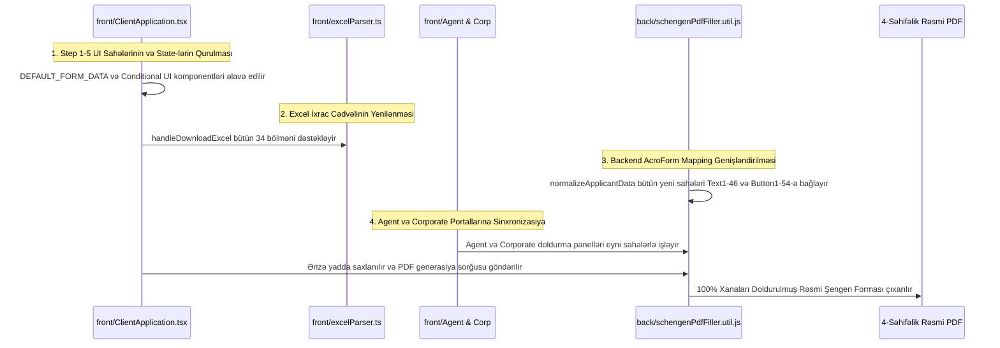

# Rəsmi Şengen Formasının 5 Addıma İnteqrasiyası: Fayllar və Funksiyalar Planı

Bu sənəd rəsmi 4 səhifəlik Avropa İttifaqı Şengen Viza Ərizə Formasındakı bütün məlumatların sistemin 5 addımlı anketinə əlavə edilməsi üçün **dəyişdiriləcək bütün faylların**, **hər bir addıma əlavə olunacaq xüsusi funksiyaların** və **sahələrin texniki xəritələnməsini** təfərrüatlı şəkildə təqdim edir.

---

## 1. Dəyişdiriləcək Faylların Siyahısı və Rolu

| # | Fayl Yolu | Layihə Tərəfi | Bu Faylın Rolu və Görüləcək İş |
|---|---|---|---|
| **1** | `front/src/modules/client/pages/Application/ClientApplication.tsx` | **Frontend (Client B2C)** | Skrinşotda göstərilən əsas 5 addımlı anket. Bütün çatışmayan sahələr buradakı 5 addıma əlavə ediləcək, form validasiyası, proqres hesablama və Excel/PDF endirmə funksiyaları yenilənəcək. |
| **2** | `back/utils/schengenPdfFiller.util.js` | **Backend (PDF Engine)** | AcroForm doldurma mühərriki. Frontenddən gələn bütün yeni sahələri qəbul edib rəsmi PDF-in 110 sahəsinə (`Text1`–`Text46`, `Button1`–`Button54`) Unikod fontlarla yazacaq. |
| **3** | `front/src/modules/agent/pages/Groups/AgentGroups.tsx` | **Frontend (Agent B2B)** | Tur operatorun qrup sərnişinlərini redaktə etdiyi 5 addımlı panel. Yeni Şengen sahələri bura da əlavə edilərək operatorun sərnişin məlumatlarını tam doldurması təmin ediləcək. |
| **4** | `front/src/modules/agent/pages/ApplicantFill/AgentApplicantFill.tsx` | **Frontend (Agent Self-Fill)** | Turistlərin kənardan daxil olub öz məlumatlarını doldurduğu qonaq səhifəsi. Barmaq izi, doğumdakı vətəndaşlıq və s. sahələr bura əlavə ediləcək. |
| **5** | `front/src/modules/corporate/pages/Batches/CorporateBatches.tsx` | **Frontend (Corporate B2B)** | Korporativ partnyorun (HR) ezamiyyət əməkdaşlarını idarə etdiyi form. Dəvət edən xarici şirkət, əlaqələndirici şəxs və xərclərin qarşılanması bölmələri bağlanacaq. |
| **6** | `front/src/modules/corporate/pages/Delegation/CorporateDelegation.tsx` | **Frontend (Corp Self-Fill)** | Əməkdaşın öz mobil nümayəndəlik linki ilə daxil olub məlumatlarını təsdiqlədiyi səhifə. Məlumatların PDF-ə tam ötürülməsi tamamlanacaq. |

---

## 2. Hər Addıma (Step 1 - Step 5) Əlavə Ediləcək Funksiyalar və Sahələr

### 📍 STEP 1: YOUR PLANS (Səfər Məqsədi və Planları)
**Fayl:** `front/src/modules/client/pages/Application/ClientApplication.tsx`  
**Məqsəd:** Rəsmi PDF-in 23, 24, 25, 28, 29, 30-cu bölmələrini tam əhatə etmək.

#### Əlavə ediləcək Funksiyalar və State:
1. `purpose`: Mövcud dropdown-a `"Visiting family or friends"` variantı əlavə edilir (`Button27`).
2. `purposeOtherDetails`: Əgər `purpose === 'Other'` seçilərsə, sərbəst izahat üçün mətn xanası açılır (PDF Qutu 23 / `Text26`).
3. `purposeDetails`: "Səfər məqsədi haqqında əlavə məlumatlar" (PDF Qutu 24 / `Text26`).
4. `otherDestinations`: "Digər səfər ediləcək Şengen ölkələri" (PDF Qutu 25).
5. **Barmaq İzi Alt Bloku (PDF Qutu 29):**
   - `fingerprintsGiven` (`'No' | 'Yes'` radio/toggle - `Button38`/`Button39`)
   - `fingerprintDate` (Bəli seçilərsə tarix xanası - `Text31`)
   - `fingerprintVisaNumber` (Bəli seçilərsə əvvəlki viza nömrəsi - `Text32`)
6. **Son Təyinat Ölkəsi İcazəsi (Tranzit üçün - PDF Qutu 30):**
   - `hasFinalEntryPermit` (`boolean` toggle)
   - `finalPermitIssuedBy` (İcazəni verən orqan - `Text33`)
   - `finalPermitValidFrom` (Başlama tarixi - `Text34`)
   - `finalPermitValidUntil` (Bitmə tarixi - `Text35`)

---

### 📍 STEP 2: YOUR INFORMATION (Şəxsi Məlumatlar)
**Fayl:** `front/src/modules/client/pages/Application/ClientApplication.tsx`  
**Məqsəd:** Rəsmi PDF-in 1-ci səhifəsindəki 7, 8, 9, 10-cu bölmələri tam əhatə etmək.

#### Əlavə ediləcək Funksiyalar və State:
1. `nationalityAtBirth`: Doğumdakı vətəndaşlıq (əgər cari vətəndaşlıqdan fərqlidirsə - PDF Qutu 7).
2. `otherNationalities`: İkili və ya digər vətəndaşlıqlar (PDF Qutu 7).
3. `gender`: Dropdown-a `"Other"` variantı əlavə edilir (`Button3`).
4. `maritalStatus`: Dropdown-a `"Registered Partnership"` (`Button6`) və `"Other"` (`Button10`) əlavə edilir.
5. **Valideyn / Qəyyum Alt Bloku (Uşaqlar üçün - PDF Qutu 10):**
   - Funksiya: `checkIsMinor(birthDate)` — Doğum tarixinə görə ərizəçinin 18 yaşdan kiçik olmasını avtomatik yoxlayır və ya `hasGuardian` toggle-ı ilə aktivləşir.
   - `guardianSurname` & `guardianFirstName` (Valideynin adı və soyadı)
   - `guardianAddress` (Valideynin ünvanı)
   - `guardianPhone` (Valideynin əlaqə telefonu)
   - `guardianEmail` (Valideynin e-poçt ünvanı)
   - `guardianNationality` (Valideynin vətəndaşlığı)

---

### 📍 STEP 3: TRAVEL DOCUMENT (Səyahət Sənədi / Pasport)
**Fayl:** `front/src/modules/client/pages/Application/ClientApplication.tsx`  
**Məqsəd:** Rəsmi PDF-in 12, 17, 18, 20-ci bölmələrini tam əhatə etmək.

#### Əlavə ediləcək Funksiyalar və State:
1. `passportType`: Dropdown-a `"Other travel document"` variantı əlavə olunur (`Button16`).
2. `passportTypeOther`: Digər sənəd seçilərsə, sənədin dəqiq adı.
3. **Başqa Ölkədə Yaşayış İcazəsi (Oturum - PDF Qutu 20):**
   - `residenceOther` (`'No' | 'Yes'` - `Button23`/`Button24`)
   - Əgər `'Yes'` olarsa:
     - `residenceType` (İcazənin növü - `Text21`)
     - `residenceNumber` (Qeydiyyat/Vəsiqə nömrəsi - `Text22`)
     - `residenceValidUntil` (Etibarlılıq tarixi - `Text23`)
4. **Aİ, EEA, İsveçrə və ya Böyük Britaniya Vətəndaşının Ailə Üzvü (PDF Qutu 17 & 18):**
   - `isEuFamilyMember` (`boolean` toggle)
   - Əgər aktivdirsə:
     - `euFamSurname` (Soyadı - `Text13`)
     - `euFamFirstName` (Adı - `Text14`)
     - `euFamDob` (Doğum tarixi - `Text15`)
     - `euFamNationality` (Vətəndaşlığı - `Text16`)
     - `euFamDocNumber` (Pasport və ya Şəxsiyyət vəsiqəsi nömrəsi - `Text17`)
     - `euFamRelationship` (`spouse`, `child`, `grandchild`, `ascendant`, `partner`, `other` - `Button17`–`Button22`)

---

### 📍 STEP 4: YOUR STAY & SPONSOR (Qalma Yeri, Dəvət Edən Tərəf və Maliyyə)
**Fayl:** `front/src/modules/client/pages/Application/ClientApplication.tsx`  
**Məqsəd:** Rəsmi PDF-in 31, 32, 33-cü bölmələrini tam əhatə etmək.

#### Əlavə ediləcək Funksiyalar və State:
1. **Dəvət Tipi Seçimi (`invitationType`):**
   - Variant A: `"PERSON_HOTEL"` (Fərdi şəxs və ya Otel - Qutu 31)
     - `invitingParty` (Şəxsin adı və ya Otelin adı - `Text36`)
     - `address` (Otelin və ya şəxsin ünvanı - `Text37`)
     - `stayEmail` (E-poçt - `Text38`)
     - `stayPhone` (Telefon - `Text39`)
   - Variant B: `"COMPANY_ORG"` (Dəvət edən Şirkət və ya Təşkilat - Qutu 32)
     - `invitingCompanyName` (Dəvət edən şirkətin adı - `Text40`)
     - `invitingCompanyAddress` (Şirkətin hüquqi ünvanı - `Text41`)
     - `companyPhone` (Şirkətin rəsmi telefonu)
     - `contactPersonFullName` (Şirkətdəki məsul şəxsin tam adı - `Text42`)
     - `contactPersonAddress` (Məsul şəxsin ünvanı - `Text43`)
     - `contactPersonEmail` (Məsul şəxsin e-poçtu - `Text44`)
     - `contactPersonPhone` (Məsul şəxsin birbaşa telefonu - `Text46`)
2. **Xərclərin Ödənilməsi və Maliyyə Təminatı (PDF Qutu 33):**
   - Mövcud təkli dropdown əvəzinə rəsmi PDF-dəki kimi ikiqat seçim matrisi:
   - **Əgər "Ərizəçi Özü Ödəyir" seçilərsə:**
     - ☑ Nağd pul (`Button40`)
     - ☑ Kredit kartı (`Button42`)
     - ☑ Səyahət çekləri (`Button41`)
     - ☑ Əvvəlcədən ödənilmiş yaşayış yeri (`Button43`)
     - ☑ Əvvəlcədən ödənilmiş nəqliyyat (`Button44`)
     - ☑ Digər (`Button45`) + `applicantExpenseOther`
   - **Əgər "Sponsor / Şirkət Ödəyir" seçilərsə:**
     - Sponsor növü: Qutu 31-dəki dəvətçi / Qutu 32-dəki şirkət / Digər sponsor (`Button47-49`)
     - ☑ Nağd pul (`Button50`)
     - ☑ Yaşayış yeri təmin edilir (`Button51`)
     - ☑ Səfər boyu bütün xərclər qarşılanır (`Button52`)
     - ☑ Nəqliyyat təmin edilir (`Button53`)
     - ☑ Digər (`Button54`) + `sponsorExpenseOther`

---

### 📍 STEP 5: CONTACTS & JOB (Əlaqə və Məşğulluq)
**Fayl:** `front/src/modules/client/pages/Application/ClientApplication.tsx`  
**Məqsəd:** Rəsmi PDF-in 19, 21, 22, 34-cü bölmələrini tam əhatə etmək.

#### Əlavə ediləcək Funksiyalar və State:
1. `employerPhone`: İşəgötürənin və ya Təhsil müəssisəsinin ayrıca rəsmi əlaqə telefonu (PDF Qutu 22).
2. **Ərizəni Başqa Şəxs Doldurursa (PDF Qutu 34):**
   - `isFilledByOther` (`boolean` toggle)
   - Əgər aktivdirsə:
     - `fillerFullName` (Dolduran şəxsin adı və soyadı)
     - `fillerAddress` (Dolduran şəxsin ünvanı)
     - `fillerEmail` (Dolduran şəxsin e-poçtu)
     - `fillerPhone` (Dolduran şəxsin əlaqə telefonu)

---

## 3. Backend Mühərrikində (`schengenPdfFiller.util.js`) Görüləcək İşlər

**Fayl:** `back/utils/schengenPdfFiller.util.js`

1. **`normalizeApplicantData` funksiyasının genişləndirilməsi:**
   - Frontenddən `formDataJson` içərisində göndərilən bütün yeni sahələr (məs. `guardianFullName`, `euFamSurname`, `fingerprintsGiven`, `invitingCompanyName`, `applicantExpenses` və s.) təmizlənir və birbaşa PDF xəritələmə lüğətinə bağlanır.
2. **`fields` xəritələmə obyektinin tam 110 sahəyə çatdırılması:**
   - `Text10` ➔ Qəyyum məlumatları
   - `Text13`–`Text17` ➔ Aİ ailə üzvünün məlumatları
   - `Button17`–`Button22` ➔ Aİ qohumluq əlaqəsi checkbox-ları
   - `Button23`–`Button24` ➔ Yaşayış icazəsi (Oturum) checkbox-ları
   - `Text21`–`Text23` ➔ Yaşayış icazəsinin nömrəsi və tarixi
   - `Text26` ➔ Səfər məqsədi və əlavə izahatlar
   - `Button38`–`Button39` ➔ Barmaq izi Bəli/Xeyr
   - `Text31`–`Text32` ➔ Barmaq izi tarixi və viza nömrəsi
   - `Text33`–`Text35` ➔ Son təyinat ölkəsi icazəsi
   - `Text40`–`Text46` ➔ Dəvət edən şirkət və məsul şəxsin bütün rekvizitləri
   - `Button40`–`Button54` ➔ Xərclərin çoxseçimli ödəniş formaları
   - `Text47`–`Text51` / Qutu 34 ➔ Ərizəni dolduran şəxsin rekvizitləri

---

## 4. İcra Ardıcıllığı (Roadmap)

Bu plan təsdiqləndikdən sonra dərhal mərhələli şəkildə kodlaşdırmaya başlanacaq.
