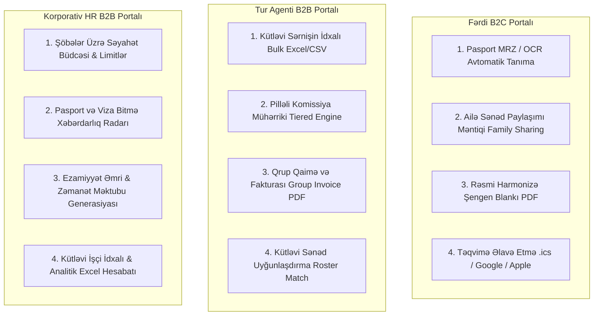

# ⚙️ FAZA 2: PORTALLARIN BİZNES MƏNTİQLƏRİNİN DƏRİNLƏŞDİRİLMƏSİ VƏ FƏRDİLƏŞDİRİLMƏSİ (MASTER PLAN)

> **Sənəd Növü:** Faza 2 Dərin İcra və Texniki Memarlıq Planı  
> **Tarix:** 27 Sentyabr 2026  
> **Status:** İcraya Hazır  
> **Əhatə Etdiyi Portallar:**  
> 1. 👤 Fərdi Müştəri Portalı (B2C Client)  
> 2. 🏢 Turizm Agenti Portalı (B2B Agent)  
> 3. 🌐 Korporativ Şirkət Portalı (B2B Corporate HR)

---

## 🎯 1. Faza 2-nin Əsas Məqsədi və Fəlsəfəsi

**Faza 1**-də biz sistemin ən böyük çatışmazlığı olan **İnzibatçı & Konsulluq Portalını (`/admin`)** sıfırdan qurduq və bütün dövriyyəni bağladıq.

**Faza 2-nin məqsədi:** Mövcud 3 istifadəçi portalını (Fərdi, Tur Agenti, Korporativ) sadə məlumat daxil etmə formalarından çıxarıb, **dünya səviyyəli avtomatlaşdırılmış, vaxta qənaət edən və real biznes ehtiyaclarını qarşılayan rəqəmsal güc mərkəzinə** çevirməkdir.

Bu fazada hər 3 portal üzrə 4 əsas böyük innovasiya icra ediləcək:

---

# 👤 HİSSƏ 1: FƏRDİ MÜŞTƏRİ PORTALININ (B2C) TƏKMİLLƏŞDİRİLMƏSİ

## 1.1. Pasport MRZ (Machine Readable Zone) və OCR Tanıma
* **Mövcud Çatışmazlıq:** İstifadəçi pasport nömrəsini, adını, soyadını, doğum tarixini və etibarlılıq müddətini anketdə əllə yazır. İnsan faktoru səbəbindən hərflər səhv yazılır və səfirlik vizanı rədd edir.
* **Həll:**
  * İstifadəçi pasportun əsas səhifəsinin fotosunu yüklədikdə brauzer səviyyəsində və ya backend-də pasportun aşağısındakı 2 sətirlik beynəlxalq **MRZ (ICAO 9303)** kodunu oxuyan mühərrik qoşulur.
  * Pasport nömrəsi, soyad, ad, vətəndaşlıq (AZE), doğum tarixi, cins və pasportun bitmə tarixi saniyələr içində tanınır və anketin uyğun xanalarına **avtomatik doldurulur**.
  * İstifadəçiyə *"Passport data extracted with 100% precision"* təsdiqi verilir.
* **Toxunulacaq Fayllar:**
  - `front/src/modules/client/wizard/Steps/Step3Applicants.tsx`
  - `front/src/modules/client/pages/Application/ClientApplication.tsx`
  - `front/src/shared/utils/mrzParser.ts` (Yeni utilit: ICAO 9303 Type 3 parser)

---

## 1.2. Ailə Müraciətlərində Sənəd Paylaşımı (Family Document Sharing)
* **Mövcud Çatışmazlıq:** Əgər ailə (ata, ana və 2 uşaq) viza üçün müraciət edirsə, hotel rezervasiyası, səyahət sığortası və ya nikah şəhadətnaməsi 4 dəfə ayrı-ayrı yüklənməlidir.
* **Həll:**
  * Ərizəçilər arasında qohumluq əlaqəsi təyin edilir (`Family Role: PRIMARY, SPOUSE, CHILD, DEPENDENT`).
  * Birgə sənədlər (Hotel Voucher, Ailə Səyahət Sığortası, Uçuş Rezervasiyası, Sponsorluq Bəyannaməsi) **"Share with all co-applicants"** seçimi ilə bir dəfə yüklənir və avtomatik olaraq qrupdakı bütün ailə üzvlərinin dosyesinə bağlanır.
* **Toxunulacaq Fayllar:**
  - `back/prisma/schema.prisma` (`Applicant.relationship`, `ApplicantDocument.isShared`)
  - `front/src/modules/client/pages/Documents/ClientDocuments.tsx`
  - `front/src/modules/client/wizard/Steps/Step3Applicants.tsx`

---

## 1.3. Rəsmi Harmonizə Edilmiş Şengen Blankı (Official Schengen Visa Application PDF)
* **Mövcud Çatışmazlıq:** Sistem sadə dosye xülasəsi PDF-i hazırlayır, lakin səfirliklər 37 bənddən ibarət rəsmi **"Harmonised Application Form for Schengen Visa"** tələb edir.
* **Həll:**
  * `pdf-lib` vasitəsilə rəsmi Şengen viza blankının koordinat xəritəsi qurulur.
  * Ərizəçinin doldurduğu bütün məlumatlar (ölkə, səfər məqsədi, dəvət edən tərəfin ünvanı, biometriya tarixi) rəsmi 4 səhifəlik blanka yazılır və müştəri müraciətini tamamladıqda dərhal çap edib imzalaya biləcəyi rəsmi blankı endirir.
* **Toxunulacaq Fayllar:**
  - `back/utils/pdfGenerator.js` (Yeni funksiya: `generateHarmonizedSchengenPdf`)
  - `back/modules/dossier/dossier.service.js`
  - `front/src/modules/client/pages/Application/ClientApplication.tsx`

---

## 1.4. Təqvim Sinxronizasiyası (.ics / Google Calendar / Apple Calendar)
* **Mövcud Çatışmazlıq:** Təsdiqlənən konsulluq randevusu yalnız ekranda görünür, müştəri unuda bilər.
* **Həll:**
  * Randevu təsdiqləndikdə `Add to Calendar` düyməsi:
    - 📅 **Google Calendar:** Birbaşa linklə hadisə açılması (Başlıq: *EuroTech Consular Biometrics Appointment*, Ünvan, Tarix, Xatırlatma 24 saat əvvəl).
    - 🍎 **Apple / Outlook Calendar (.ics):** Standart iCalendar faylının endirilməsi.
* **Toxunulacaq Fayllar:**
  - `front/src/shared/utils/calendar.util.ts` (Yeni utilit)
  - `front/src/modules/client/pages/Appointment/ClientAppointment.tsx`

---

# 🏢 HİSSƏ 2: TURİZM AGENTLİYİ PORTALININ (B2B AGENT) TƏKMİLLƏŞDİRİLMƏSİ

## 2.1. Kütləvi Sərnişin İdxalı (Bulk Passenger Roster Import via Excel / CSV)
* **Mövcud Çatışmazlıq:** 40 nəfərlik qrup turunu daxil etmək üçün agent 40 dəfə əllə formu doldurmalıdır (bu, 2 saat vaxt aparır).
* **Həll:**
  * **"Download Excel Template"** düyməsi: Agent rəsmi sütunları olan faylı endirir (`First Name`, `Last Name`, `Passport Number`, `Date of Birth`, `Gender`, `Nationality`).
  * **"Upload Roster" (Sürüklə & Burax):** Agent faylı yükləyir. Sistem faylı dərhal oxuyur (`SheetJS / xlsx`), sətir-sətir validasiya edir:
    - Pasport nömrələrinin düzgünlüyü,
    - Təkrarlanan sərnişinlərin xəbərdarlığı,
    - Doğum tarixlərinin formatı.
  * Cəmi 3 saniyə ərzində bütün 40 sərnişin qrupa əlavə edilir və hər biri üçün avtomatik anket qovluğu açılır.
* **Toxunulacaq Fayllar:**
  - `front/src/modules/agent/pages/Groups/AgentGroups.tsx`
  - `front/src/modules/agent/wizard/AgentWizard.tsx`
  - `front/src/shared/utils/excelParser.ts` (Yeni utilit)

---

## 2.2. Pilləli Komissiya Mühərriki və Tərəfdaş Səviyyələri (Tiered Commission Engine)
* **Mövcud Çatışmazlıq:** Hazırda komissiya hər sərnişin üçün sabit €20 təşkil edir. Böyük turoperatorlar üçün motivasiya mexanizmi yoxdur.
* **Həll:**
  * Həcmə əsaslanan 4 tərəfdaş dərəcəsi:
    - **Bronze Partner (1-20 sərnişin/ay):** €20 / sərnişin
    - **Silver Partner (21-50 sərnişin/ay):** €25 / sərnişin
    - **Gold Partner (51-100 sərnişin/ay):** €28 / sərnişin
    - **Platinum VIP (100+ sərnişin/ay):** €32 / sərnişin
  * Agentin maliyyə səhifəsində (`AgentFinance.tsx`) cari səviyyə, növbəti səviyyəyə çatmaq üçün qalan sərnişin sayı və qazanılmış bonuslar canlı vizuallaşdırılır.
* **Toxunulacaq Fayllar:**
  - `back/prisma/schema.prisma` (`User.agentTier`)
  - `back/modules/agent/agent.service.js`
  - `front/src/modules/agent/pages/Finance/AgentFinance.tsx`

---

## 2.3. Rəsmi Qrup Qaiməsi və Xidmət Fakturası (Group Proforma & VAT Invoice PDF)
* **Mövcud Çatışmazlıq:** Tur agentliyi öz mühasibatlığı və turistlərdən ödəniş yığmaq üçün rəsmi qaiməyə ehtiyac duyur.
* **Həll:**
  * Qrup üçün rəsmi **Group Consular Invoice** generasiyası:
    - Qrup Kodu: `GRP-XXXX`
    - Sərnişinlərin siyahısı və hər biri üzrə rüsum bölgüsü (Dövlət rüsumu + Viza Mərkəzi xidməti + Əlavə xidmətlər),
    - Agentlik endirimi və xalis ödəniləcək məbləğ,
    - Rəsmi QR kod və EuroTech bank rekvizitləri.
* **Toxunulacaq Fayllar:**
  - `back/utils/pdfGenerator.js` (`generateGroupInvoicePdf`)
  - `back/modules/agent/agent.service.js`
  - `front/src/modules/agent/pages/Groups/AgentGroups.tsx`

---

## 2.4. Qrup Sərnişinlərinin Sənədlərinin Kütləvi Uyğunlaşdırılması (Bulk Document Matcher)
* **Mövcud Çatışmazlıq:** 30 sərnişinin pasport skanını tək-tək yükləmək çox vaxt aparır.
* **Həll:**
  * Agent bütün pasportları bir qovluqda saxlayır (Fayl adları: `C12345678_passport.pdf`, `C87654321_passport.pdf`).
  * Bütün faylları birdən seçib yükləyir; sistem fayl adındakı pasport nömrəsini qrupdakı sərnişinlərlə avtomatik calayır (match edir).
* **Toxunulacaq Fayllar:**
  - `front/src/modules/agent/pages/Groups/AgentGroups.tsx`

---

# 🌐 HİSSƏ 3: KORPORATİV MOBİLLİK PORTALININ (B2B CORPORATE) TƏKMİLLƏŞDİRİLMƏSİ

## 3.1. Şöbələr Üzrə Səyahət Büdcəsi və Xərc Limitləri (Departmental Travel Budgeting)
* **Mövcud Çatışmazlıq:** Şirkətlərdə hər departamentin (IT, Satış, Rəhbərlik, Mühəndislik) öz viza və ezamiyyət büdcəsi olur. Hazırda büdcə nəzarəti yoxdur.
* **Həll:**
  * Şöbələr üzrə büdcə modulu:
    - İllik / Rüblük ayrılmış büdcə,
    - Cari xərclənmiş məbləğ,
    - Qalan sərbəst limit.
  * Əgər yeni partiya yaradılarkən seçilən departamentin büdcəsi çatışmırsa, HR menecerə xəbərdarlıq çıxır və ya təsdiq üçün rəhbərliyə xüsusi qeyd göndərilir.
* **Toxunulacaq Fayllar:**
  - `back/prisma/schema.prisma` (`CorporateDepartment` modeli)
  - `back/modules/corporate/corporate.service.js`
  - `front/src/modules/corporate/pages/Finance/CorporateFinance.tsx`
  - `front/src/modules/corporate/wizard/CorporateWizard.tsx`

---

## 3.2. Pasport və Viza Bitmə Xəbərdarlıq Radarı (Passport & Visa Expiry Radar)
* **Mövcud Çatışmazlıq:** Şirkətin 200 işçisi varsa, HR kimin pasportunun və ya Şengen vizasının nə vaxt bitdiyini izləyə bilmir. Nəticədə hava limanında işçinin səfəri təxirə düşür.
* **Həll:**
  * **Consular Expiry Radar:**
    - 🔴 **Kritik (30 gün qalıb):** Səyahət qadağandır, dərhal pasport/viza yenilənməlidir.
    - 🟡 **Xəbərdarlıq (90 gün qalıb):** Şengen qaydalarına görə viza müraciəti üçün pasportun ən azı 3-6 ay etibarlılığı olmalıdır.
    - 🟢 **Etibarlı (180+ gün).**
  * HR Dashboard-da tək kliklə "Expiring Soon (5 Employees)" filtri və işçilərə 1 kliklə xatırlatma e-poçtu göndərilməsi.
* **Toxunulacaq Fayllar:**
  - `back/modules/corporate/corporate.service.js`
  - `front/src/modules/corporate/pages/Dashboard/CorporateDashboard.tsx`
  - `front/src/modules/corporate/pages/Employees/CorporateEmployees.tsx`

---

## 3.3. Rəsmi Ezamiyyət Əmri və Şirkət Zəmanət Məktubunun Generasiyası (Mission Order & Guarantee Letter)
* **Mövcud Çatışmazlıq:** Səfirliklər korporativ viza üçün şirkətdən rəsmi dəstək məktubu (Employment & Financial Guarantee Letter) tələb edir. HR bunu hər işçi üçün əllə tərtib edir.
* **Həll:**
  * Sistem şirkətin profil məlumatlarını (VÖEN, Ünvan, Şirkət adı) və işçinin vəzifəsini götürərək avtomatik rəsmi **Diplomatic Guarantee & Travel Mission Letter (PDF)** hazırlayır.
  * Məktubda səfirlik üçün zəruri olan bütün bəndlər (səfər müddətində bütün xərclərin şirkət tərəfindən ödəniləcəyi, işçinin vəzifəsinin qorunub saxlanacağı) standart diplomatik dildə formalaşdırılır.
* **Toxunulacaq Fayllar:**
  - `back/utils/pdfGenerator.js` (`generateCorporateGuaranteeLetterPdf`)
  - `back/modules/corporate/corporate.service.js`
  - `front/src/modules/corporate/pages/Batches/CorporateBatches.tsx`

---

## 3.4. Kütləvi İşçi İdxalı və Excel Analitika Hesabatı (HR Bulk Sync & Export)
* **Mövcud Çatışmazlıq:** Yeni korporativ müştəri sistemə qoşulduqda 100 işçini tək-tək yazmaq istəmir.
* **Həll:**
  * HR Excel faylı vasitəsilə bütün şirkət işçilərini (Ad, Soyad, Vəzifə, Şöbə, Pasport No, Bitmə tarixi, E-poçt) 1 saniyədə idxal edir.
  * Şirkətin illik mobillik və viza xərclərini Excel hesabatı kimi ixrac edir.
* **Toxunulacaq Fayllar:**
  - `front/src/modules/corporate/pages/Employees/CorporateEmployees.tsx`
  - `front/src/modules/corporate/pages/Finance/CorporateFinance.tsx`

---

# 📅 4. FAZA 2-NİN ADDIM-ADDIM İCRA ARDICILLIĞI

Faza 2-nin icrasını 4 nizamlı mərhələyə bölürük:

### 🔹 Mərhələ 2.1: Baza Sxemi və Backend Utilitləri
1. `prisma/schema.prisma`-ya `CorporateDepartment`, `Applicant.familyRole`, `User.agentTier` əlavə edilməsi və miqrasiya.
2. `back/utils/pdfGenerator.js`-ə Harmonizə Şengen Blankı, Qrup Qaiməsi və Korporativ Zəmanət Məktubu şablonlarının əlavə edilməsi.
3. Backend xidmətlərində (`client`, `agent`, `corporate`) müvafiq endpoint-lərin açılması.

### 🔹 Mərhələ 2.2: Fərdi Müştəri Təkmilləşdirmələri
1. Frontend-də `mrzParser.ts` inteqrasiyası və pasport yüklənərkən avtomatik anket doldurulması.
2. Ailə müraciətlərində ortaq sənəd paylaşımı məntiqinin qoşulması.
3. Rəsmi Şengen blankının və `.ics` təqvim hadisəsinin generasiyası.

### 🔹 Mərhələ 2.3: Turizm Agenti Təkmilləşdirmələri
1. Excel/CSV sərnişin idxalı (`xlsx` parser) və cədvəldə canlı validasiya.
2. Pilləli komissiya (Bronze/Silver/Gold/Platinum) hesablama məntiqi və UI paneli.
3. Qrup üçün rəsmi xidmət qaiməsinin generasiyası.

### 🔹 Mərhələ 2.4: Korporativ HR Təkmilləşdirmələri
1. Şöbə büdcəsi idarəetməsi və xərc xəbərdarlıqları.
2. Pasport və viza bitmə radarı (Expiry Alerts & Quick Reminder).
3. Rəsmi korporativ zəmanət məktubu və ezamiyyət əmri generatoru.
4. Kütləvi işçi idxalı.

---

# ✅ 5. FAZA 2-NİN QƏBUL VƏ TEST KRİTERİYALARI (ACCEPTANCE CRITERIA)

1. **MRZ Testi:** Pasport şəkli yükləndikdə ad, soyad, pasport no və tarixlər 100% dəqiqliklə anketə dolmalıdır.
2. **Harmonizə Blank Testi:** 5 addımlı anket doldurulduqda rəsmi 4 səhifəlik Şengen viza müraciət blankı PDF olaraq düzgün koordinatlarla generasiya edilməlidir.
3. **Agent Excel İdxalı Testi:** 30 sərnişinlik test Excel faylı yükləndikdə sərnişinlər səhvsiz qrupa əlavə olunmalıdır.
4. **Pilləli Komissiya Testi:** Qrup sərnişin sayı 25-i keçdikdə komissiya dərəcəsi avtomatik €25/nəfər olmalıdır.
5. **Korporativ Radar Testi:** Pasportunun bitməsinə 90 gündən az qalmış işçi Dashboard-da qırmızı xəbərdarlıqla qeyd olunmalıdır.
6. **Zəmanət Məktubu Testi:** Korporativ partiyada işçi üçün 1 kliklə şirkət loqolu rəsmi zəmanət məktubu PDF-i generasiya olunmalıdır.

---

## 📌 GƏLƏCƏK FAZALARIN QISA XATIRLATMASI
- **FAZA 3:** Real Xarici İnteqrasiyalar (Real SMTP E-poçt, Stripe/Bank Kartları, SMS/WhatsApp).
- **FAZA 4:** Çoxdillilik (AZ / EN / RU), Təhlükəsizlik Auditi və Cloud Production Deploy.
