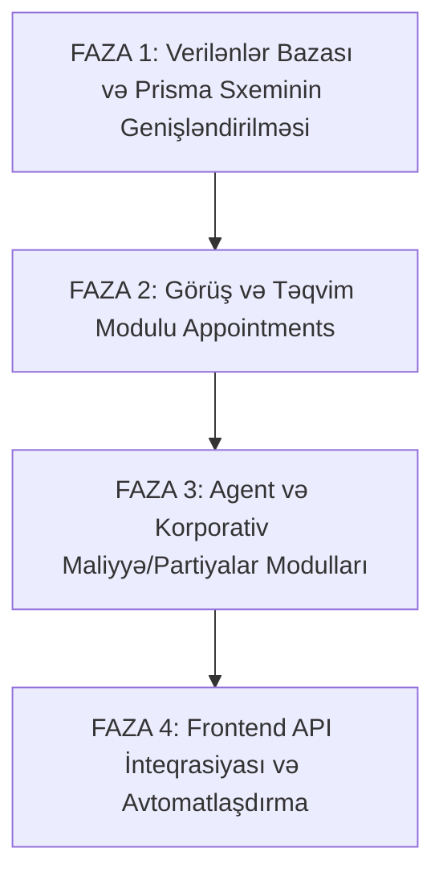

# EUROTECH Portal — Tam Analiz və Backend Boşluqları (GAP) Planı

Bu sənəd `EUROTECH Portal` frontend tətbiqinin tam memarlıq və funksional analizini, frontend-də mövcud olub `back` (backend) sistemində **çatışmayan bütün modulları, məlumat strukturlarını və API-ləri**, eləcə də bu boşluqları aradan qaldırmaq üçün addım-addım icra planını əhatə edir.

> [!NOTE]
> `AgentAppointments.tsx` faylı istifadəçinin tələbinə əsasən toxunulmaz saxlanılmışdır.

---

## 1. `EUROTECH Portal` Ümumi Memarlığı

* **Texnologiya:** React 19 + TypeScript + Vite + `react-router-dom` v7
* **Stil və Dizayn:** Vanilla CSS (Müasir Dark & Glassmorphism qaranlıq interfeys, animasiyalar, adaptiv grid-lər)
* **3 Fərqli İstifadəçi Portalı (Multi-Portal Ecosystem):**
  1. **Individual (Fərdi Müştəri) Portalı:** Viza sehrbazı, sənəd anbarı, konsulluq ərizəsi, görüş təyini, əlavə xidmətlər, canlı izləmə.
  2. **Agent (Tur Operator / Acentlik) Portalı:** Tur qruplarının idarə edilməsi (`Groups`), toplu ərizəçilər, təqvim və görüş slotları (`Appointments`), komissiya və pul kisəsi (`Finance`).
  3. **Corporate (Şirkət HR / Qlobal Mobillik) Portalı:** İşçi partiyaları (`Batches`), işçi reyestri və viza tarixçəsi (`Employees`), nümayəndəlik linkləri (`Delegation Links`), görüş cədvəli (`Appointments`), korporativ fakturalar və pul kisəsi (`Finance`).

---

## 2. Frontend-də Olan, Lakin Backend-də (back) Olmayan Çatışmazlıqların Tam Siyahısı

Aparılan müqayisəli analiz nəticəsində backend-də 9 böyük sistem və arxitektur boşluq aşkar edilmişdir:

### 1. Görüş və Təqvim Sistemi (Appointments & Slot Management)
* **Frontend-də nə var?**
  * `ClientAppointment.tsx`: Fərdi müştərinin görüş statusu (`confirmed` / `cancelled`), görüşün vaxtını dəyişmə (`Reschedule`), görüşün ləğvi (`Cancel`), yeni görüş bronu.
  * `AgentAppointments.tsx`: Ay/gün üzrə interaktiv təqvim, vaxt slotları (`TimeSlot: id, time, status, capacity: '8/10', package: 'Premium Bundle' | 'VIP Platinum'`), sərnişin siyahısı ilə slot baxışı, görüş vaxtının dəyişdirilməsi və **Qrup Manifestinin (PDF) endirilməsi**.
  * `CorporateAppointments.tsx`: Şirkət partiyaları üzrə görüş cədvəli, `status: 'Confirmed' | 'Pending Payment'`, məkan seçimi (`EuroTech Main Center` / `EuroTech Premium Lounge`).
* **Backend-də nə çatışmır?**
  * `Prisma` sxemində yalnız `appointmentDate` və `appointmentLocation` kimi 2 passiv mətn sahəsi var.
  * `Appointment` və ya `TimeSlot` modeli **YOXDUR**.
  * Slot tutumu (`capacity`), boş slotların axtarışı (`GET /api/v1/appointments/slots`), slot bronu (`POST /api/v1/appointments/book`), vaxt dəyişmə (`PATCH /api/v1/appointments/:id/reschedule`) və ləğvetmə API-ləri **YOXDUR**.
  * Qrup üçün Manifest PDF generasiyası API-si **YOXDUR**.

---

### 2. Tur Agentləri üçün Qruplar Sistemi (Agent Groups System)
* **Frontend-də nə var?**
  * `AgentGroups.tsx` və `AgentWizard.tsx`:
    * Qrup anlayışı (`Group`): `id` (məs: `GRP-8821`), `name` (məs: "Vienna Summer Tour", "TechTrade IT Delegation"), `destination`, `travelDate`, `duration: 'short' | 'long'`, `projectReason` ("Tourism", "Business / Corporate"), `status: 'draft' | 'processing'`.
    * Hər qrup daxilində sərnişinlər (`Applicant[]`), sərnişin üzrə konsulluq formasının tamamlanma faizi (`formProgress: 0-100%`), sənəd yoxlanış statusu (`status: 'pending' | 'verified' | 'action_req'`).
    * Qrup parametrlərinin redaktəsi (Settings modal), qrupun toplu emala göndərilməsi (`Submit Group`).
* **Backend-də nə çatışmır?**
  * `Group` adlı model və ya `Dossier` ilə əlaqəli qrup metadata modeli **YOXDUR**. Backend-də yalnız `portalType: GROUP_AGENT` var, lakin qrupun adı, səyahət tarixi, qalma müddəti və məqsədi bazada saxlanılmır.
  * Qrupun toplu şəkildə statusunun idarə edilməsi və sərnişinlər üzrə `formProgress` hesablama məntiqi **YOXDUR**.

---

### 3. Agent Komissiyası, Pul Kisəsi və Çıxarış Sistemi (Agent Wallet & Commissions)
* **Frontend-də nə var?**
  * `AgentFinance.tsx`:
    * Mövcud balans (`Available Wallet Balance`: €480.00).
    * Təsdiq gözləyən balans (`Pending Clearing`: €1,250.00).
    * İllik ümumi qazanc (`Total Earned YTD`: €8,450.00).
    * Qrup üzrə komissiya daxilolmaları (`TRX-9980`: Commission per passenger, məs: 24 nəfər x €20 = €480).
    * Agentin bank rekvizitləri (Payout Method modalı: Bank adı, IBAN, SWIFT/BIC).
    * Balansdan bank hesabına pul çıxarışı (`Payout #402`).
    * Maliyyə tarixçəsinin CSV formatında ixracı (`Export CSV`).
* **Backend-də nə çatışmır?**
  * `Wallet` (Pul kisəsi) modeli **YOXDUR**.
  * `Commission` (Komissiya qaydaları və faizləri) modeli **YOXDUR**.
  * `Payout` və `PayoutMethod` (Bank/IBAN rekvizitləri) modeli **YOXDUR**.
  * Agentin tamamlanan dosyelərdən avtomatik komissiya qazanması və çıxarış tələbi etməsi üçün heç bir xidmət (service) **YOXDUR**.

---

### 4. Korporativ Partiyalar (Batches) və Nümayəndəlik Linkləri (Delegation Links)
* **Frontend-də nə var?**
  * `CorporateBatches.tsx` və `CorporateWizard.tsx`:
    * Partiya (`Batch`): `id` (`BCH-2026-101`), `name` ("Vienna Summit Delegation"), `destination`, `travelDate`, `duration`, `projectReason`, `status: 'draft' | 'processing' | 'ready'`.
    * **Nümayəndəlik Linki (Delegation Link):** HR menecer hər bir işçi üçün unikal link kopyalayır (`Copy Delegation Link`) və işçiyə göndərir. İşçi portala daxil olmadan həmin təhlükəsiz linklə öz anketini doldurur və sənədlərini yükləyir.
* **Backend-də nə çatışmır?**
  * `Batch` modeli və ya Korporativ Dosye qruplaşdırması **YOXDUR**.
  * İşçiyə göndərilən nümayəndəlik linki (`Delegation Token / Guest Access`) mexanizmi və API-si **YOXDUR**.

---

### 5. Korporativ İşçi Reyestri və Viza Tarixçəsi (Employee Directory & Visa History)
* **Frontend-də nə var?**
  * `CorporateEmployees.tsx`:
    * İşçi profili: `jobTitle` (Vəzifə), `department` (Şöbə), `nationality`, `passportNo`, `passportExpiry`, `email`, `phone`, `image`.
    * Viza Tarixçəsi (`visaHistory`): İşçinin keçmiş və aktiv vizaları (`country`, `type`, `issueDate`, `expiryDate`, `status: 'Active' | 'Expired' | 'Processing'`, `batchRef`).
    * Şirkət daxili sənəd arxivi (`documents`): İş müqaviləsi, pasport nüsxələri, biometrik şəkillər.
* **Backend-də nə çatışmır?**
  * Şirkətə (`User role: CORPORATE_HR`) bağlı qalan davamlı `CorporateEmployee` modeli **YOXDUR**.
  * İşçinin vizalarını və vaxtı bitmə xəbərdarlıqlarını saxlayan `VisaRecord` modeli **YOXDUR**.
  * Hazırda backend-də işçi yalnız müvəqqəti `Applicant` kimi tək bir dosyenin içində qalır, növbəti səfərdə yenidən sıfırdan daxil edilməlidir.

---

### 6. Korporativ Pul Kisəsi, Qaimə-Fakturalar və Bank Köçürməsi (Corporate Wallet & Invoicing)
* **Frontend-də nə var?**
  * `CorporateFinance.tsx`:
    * Şirkət depozit balansı (`Wallet Balance`: €12,500.00).
    * Balansın artırılması (`Wallet Top-Up via Wire Transfer`).
    * Gözləyən fakturalar (`PendingInvoice: INV-2026-9012`, Due Date, Məbləğ, İşçi sayı).
    * Çoxvariantlı ödəniş: `wallet` (şirkət balansından birbaşa silinmə), `card` (kartla ödəmə), `invoice` (Proforma Invoice generasiyası və bank köçürməsi təsdiqi).
    * Hesabatın ixracı (`Export Statement`).
* **Backend-də nə çatışmır?**
  * Şirkət depozit hesabı (`CorporateWallet`) və depozit tranzaksiyaları **YOXDUR**.
  * Faktura (`Invoice` / `ProformaInvoice`) generasiyası və status izlənməsi **YOXDUR**.
  * Stripe-dan əlavə Bank Köçürməsi (Wire Transfer) və Balansdan Ödəniş mexanizmi **YOXDUR**.

---

### 7. Xidmət Paketləri və Sərnişinə Xüsusi Xidmət Təyini (Packages & Per-Applicant Services)
* **Frontend-də nə var?**
  * Xidmət paketləri: `standard`, `premium`, `vip`, `custom`.
  * Genişləndirilmiş xidmətlər: `lounge` (€81), `filePrep` (€55), `insurance` (€35), `hotel` (€15), `flight` (€15), `formAssist` (€24), `courier` (€20), `photo` (€12).
  * Paketin içində artıq alınmış/kilidlənmiş xidmətlər (`lockedServices`).
  * Xidmətlərin hər sərnişin üzrə ayrı-ayrılıqda səbətə əlavə edilməsi (`cart: { serviceId, applicantId }[]`).
* **Backend-də nə çatışmır?**
  * Backend-in `AdditionalService` cədvəlində `applicantId` sahəsi **YOXDUR** (yalnız `dossierId` var, yəni xidmət bütün dosyeyə aid edilir, tək sərnişinə təyin oluna bilmir).
  * Paket anlayışı (`ServiceBundle / PackageTier`) **YOXDUR**.
  * `PREMIUM_LOUNGE`, `FILE_PREPARATION`, `FORM_ASSISTANCE`, `BIOMETRIC_PHOTO` kimi xidmət növləri backend sabitlərində (`constants.js`) **YOXDUR**.

---

### 8. Canlı İzləmə Mərhələləri (Live Tracking Stepper)
* **Frontend-də nə var?**
  * `ClientTracking.tsx`: Viza müraciəti üçün 5 ardıcıl mərhələ:
    1. `File Preparation` (Dosyenin toplanması)
    2. `Ready for Appt.` (Görüş üçün hazırdır)
    3. `Submitted at VAC` (Viza mərkəzində biometriya verildi)
    4. `Consular Review` (Səfirlikdə baxışda)
    5. `Passport Returned` (Pasport geri qaytarıldı / təhvilə hazır)
  * Hər sərnişin üçün xüsusi hadisə loqu və tarixi (`Detailed Tracking History`).
* **Backend-də nə çatışmır?**
  * Backend-in `DossierStatus` enum-u (`RECEIVED`, `UNDER_REVIEW`, `NEEDS_CORRECTION`, `SUBMITTED_TO_CONSULATE`, `APPROVED`, `REJECTED`) frontend-in bu 5 vizual mərhələsi ilə tam uyğunlaşdırılmayıb.

---

### 9. 5 Mərhələli Rəsmi Konsulluq Ərizə Forması (Consular Application Engine)
* **Frontend-də nə var?**
  * `ClientApplication.tsx`: Ərizəçinin rəsmi anketinin 5 addımda addım-addım doldurulması (Şəxsi məlumatlar -> Pasport detalları -> Səyahət planı -> Qəbul edən tərəf/Sponsor -> Bəyannamə) və tamamlanma faizinin (`progress %`) saxlanması.
* **Backend-də nə çatışmır?**
  * `Applicant` modelində yalnız ümumi `formDataJson` var, lakin formanın mərhələli yadda saxlanması (`saveDraftStep`) və validasiyası üçün endpoint-lər **YOXDUR**.

---

# 3. İcra və İnteqrasiya Planı (Actionable Implementation Plan)

Frontend ilə Backend arasındakı bu boşluqları aradan qaldırmaq üçün sistemli 4 fazalı plan:

---

### FAZA 1: Verilənlər Bazası Sxeminin Yenilənməsi (`prisma/schema.prisma`)
1. **Model 1: `Appointment` və `TimeSlot`**
   * `TimeSlot` (id, date, startTime, capacity, bookedCount, location, isActive)
   * `Appointment` (id, dossierId?, batchId?, userId, timeSlotId, status: `CONFIRMED | PENDING_PAYMENT | CANCELLED`, location, notes)
2. **Model 2: `GroupBatch` (Agent Qrupları və Korporativ Partiyalar)**
   * `portalType` (`GROUP_AGENT` və ya `CORPORATE`)
   * `name`, `destination`, `travelDate`, `duration`, `projectReason`, `status`
   * Əlaqə: `userId`, `dossierId`, `applicants` / `employees`
3. **Model 3: `CorporateEmployee` və `VisaHistory`**
   * `CorporateEmployee` (id, corporateUserId, firstName, lastName, jobTitle, department, nationality, passportNo, passportExpiry, email, phone)
   * `VisaRecord` (id, employeeId, country, type, issueDate, expiryDate, status, batchRef)
4. **Model 4: `Wallet`, `CommissionTransaction`, `CorporateInvoice`**
   * `Wallet` (id, userId, balance, pendingBalance, currency)
   * `WalletTransaction` (id, walletId, amount, type: `CREDIT | DEBIT`, referenceType: `COMMISSION | PAYOUT | TOPUP | VISA_PAYMENT`, status)
   * `PayoutRequest` (id, walletId, amount, bankName, iban, swift, status: `PENDING | PROCESSED | REJECTED`)
   * `CorporateInvoice` (id, batchId, corporateUserId, invoiceNumber, amount, dueDate, status: `PAID | PENDING | OVERDUE`, pdfUrl)
5. **Model 5: `AdditionalService` yenilənməsi**
   * `applicantId String?` əlavə edilməsi (xidmətlərin sərnişinə görə ayrılması üçün).

---

### FAZA 2: Görüş və Təqvim Modulunun Qurulması (`modules/appointment/`)
* **Controller və Service:**
  * `getAvailableSlots(date, location)` — Seçilmiş tarix üçün boş slotların qaytarılması.
  * `bookAppointment(dossierId / batchId, timeSlotId)` — Slotun rezervasiya edilməsi.
  * `rescheduleAppointment(appointmentId, newTimeSlotId)` — Vaxtın dəyişdirilməsi.
  * `cancelAppointment(appointmentId)` — Görüşün ləğvi.
  * `generateManifestPdf(batchId / dossierId)` — Bütün qrup üçün rəsmi səfirlik manifesti PDF faylının yığılması və endirilməsi.

---

### FAZA 3: Agent və Korporativ Biznes Modulları
1. **Agent Qrupları və Komissiya (`modules/agent/`):**
   * `createGroup`, `getAgentGroups`, `submitGroupForReview`.
   * Qrup təsdiqləndikdə avtomatik agentin pul kisəsinə komissiyanın yazılması.
   * `requestPayout` — Agentin balansından bank hesabına pul çıxarış sorğusu.
2. **Korporativ Partiyalar və İşçi Reyestri (`modules/corporate/`):**
   * `createBatch`, `getCorporateBatches`.
   * `generateDelegationLink(employeeId, batchId)` — İşçiyə göndəriləcək 72 saatlıq təhlükəsiz qonaq linki.
   * `getEmployeeDirectory`, `addEmployeeToDirectory`.
   * `generateProformaInvoice(batchId)` — Bank köçürməsi üçün PDF hesab-faktura.
   * `payBatchWithWallet(batchId)` — Şirkət balansından birbaşa silinmə.

---

### FAZA 4: Frontend ilə Tam İnteqrasiya (`EUROTECH Portal/src/services/`)
1. Frontend daxilində `src/services/api.ts` mərkəzi HTTP müştərisi (Axios / Fetch wrapper) yaratmaq.
2. Mocks (saxta `useState` dataları) əvəzinə real backend API çağırışlarını qoşmaq:
   * `AuthPage.tsx` -> `POST /api/v1/auth/login` və `POST /api/v1/auth/pre-register`
   * `AgentGroups.tsx` -> `GET /api/v1/agent/groups`
   * `AgentAppointments.tsx` -> `GET /api/v1/appointments` və `GET /api/v1/agent/manifest/:id`
   * `AgentFinance.tsx` -> `GET /api/v1/agent/wallet` və `POST /api/v1/agent/payout`
   * `CorporateBatches.tsx` -> `GET /api/v1/corporate/batches`
   * `CorporateFinance.tsx` -> `GET /api/v1/corporate/invoices`
3. Tokenlərin `localStorage`-da saxlanması və qorunan marşrutların (`PrivateRoute`) aktivləşdirilməsi.

---

## 4. Xülasə

Bu plan tam icra olunduqda, `EUROTECH Portal` yalnız statik UI kimi deyil, real vaxt rejimində işləyən, hər üç istifadəçi seqmentinə (Fərdi, Tur Agent, Korporativ HR) xidmət edən bütöv bir rəqəmsal viza ekosisteminə çevriləcəkdir.
