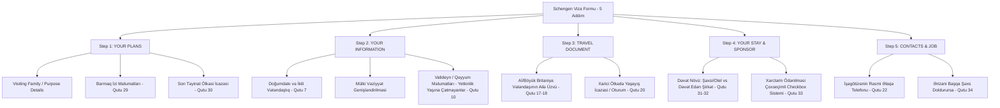

# Rəsmi Şengen Ərizə Forması (PDF) ilə Client Portal (5 Addım) Müqayisəli Təhlili və İnteqrasiya Planı

Bu sənəd istifadəçinin təqdim etdiyi skrinşotdakı **Client Portal Viza Ərizəsi (5 Addım)** ilə rəsmi Avropa İttifaqı **4 səhifəlik Şengen Viza Ərizə Forması (Harmonised Application Form - Application for Schengen Visa)** arasındakı bütün sahələrin təkbətək müqayisəli auditini (Gap Analysis) və çatışmayan sahələrin 5 addım üzrə inteqrasiya planını təqdim edir.

---

## 1. Ümumi İcmal və Mövcud Vəziyyət

Skrinşotda göstərilən Client Portal forması hazırda 5 əsas addımdan ibarətdir:
1. **Step 1: YOUR PLANS** (Səfər məqsədi və planları)
2. **Step 2: YOUR INFORMATION** (Ərizəçinin şəxsi məlumatları)
3. **Step 3: TRAVEL DOCUMENT** (Xarici pasport məlumatları)
4. **Step 4: YOUR STAY & SPONSOR** (Qalma yeri, dəvət edən tərəf və maliyyə təminatı)
5. **Step 5: CONTACTS & JOB** (Əlaqə məlumatları və iş yeri)

Rəsmi 4 səhifəlik Şengen Viza Ərizə Forması isə **34 nömrələnmiş rəsmi bölmədən** və ümumilikdə **110 AcroForm sahəsindən (`Text1`–`Text46`, `Button1`–`Button54`)** ibarətdir.

Aşağıdakı təhlildə PDF-də olan, lakin hazırkı 5 addımda **olmayan və ya natamam olan** bütün məlumatlar maddə-maddə müəyyən edilmişdir.

---

## 2. Addım-Addım Çatışmayan Sahələrin Təfərrüatlı Təhlili (Gap Analysis)

### 📌 ADDIM 1: "YOUR PLANS" (Səfər Planları və Məqsədi)

| PDF Bölməsi | PDF-dəki Rəsmi Sahə | Hazırkı Formada Vəziyyət | Çatışmayan / Əlavə Edilməli Olan Məlumat |
| :--- | :--- | :--- | :--- |
| **Qutu 23** | **Purpose(s) of the journey** | Dropdown-da natamam siyahı | • **"Visiting family or friends"** (Ailə və ya dostları ziyarət) seçimi yoxdur. • **"Other (please specify)"** seçildikdə sərbəst mətn sahəsi (`Text26`) yoxdur. |
| **Qutu 24** | **Additional information on purpose of stay** | **Yoxdur (Tamamilə Çatışmır)** | Səfər məqsədi haqqında əlavə qeydlər üçün sərbəst izahat mətni sahəsi (`Text26`). |
| **Qutu 25** | **Member State of main destination (and other Member States)** | Yalnız əsas ölkə var | Əgər səfər zamanı digər Şengen ölkələrinə də gediləcəksə, digər ölkələrin qeyd edilməsi sahəsi. |
| **Qutu 28** | **Intended date of arrival & departure** | Mövcuddur | Giriş (`arrivalDate`) və Çıxış (`departureDate`) tarixləri mövcuddur. |
| **Qutu 29** | **Fingerprints collected previously for Schengen visa** | **Yoxdur (Tamamilə Çatışmır)** | • Əvvəllər barmaq izi verilibmi? (Bəli / Xeyr) • Əgər verilibsə: Verilmə tarixi (`Text31`) və Əvvəlki viza nömrəsi (`Text32`). |
| **Qutu 30** | **Entry permit for the final country of destination** | **Yoxdur (Tamamilə Çatışmır)** | Şengendən sonra 3-cü ölkəyə gedilirsə (Tranzit): • İcazəni verən orqan (`Text33`), Etibarlılıq başlanğıcı (`Text34`), Bitmə tarixi (`Text35`). |

---

### 📌 ADDIM 2: "YOUR INFORMATION" (Şəxsi Məlumatlar)

| PDF Bölməsi | PDF-dəki Rəsmi Sahə | Hazırkı Formada Vəziyyət | Çatışmayan / Əlavə Edilməli Olan Məlumat |
| :--- | :--- | :--- | :--- |
| **Qutu 1, 2, 3** | **Surname, Surname at birth, First name** | Mövcuddur | Ad, Soyad, Doğumdakı soyad düzgün mövcuddur. |
| **Qutu 4, 5, 6** | **Date of birth, Place of birth, Country of birth** | Mövcuddur | Doğum tarixi, Doğum yeri (şəhər), Doğum ölkəsi mövcuddur. |
| **Qutu 7** | **Current nationality, Nationality at birth, Other nationalities** | Yalnız cari vətəndaşlıq var | • **Doğumdakı vətəndaşlıq (fərqlidirsə)** (`nationality_at_birth`) çatışmır. • **Digər vətəndaşlıqlar (ikili vətəndaşlıq)** (`other_nationalities`) çatışmır. |
| **Qutu 8** | **Sex (Gender)** | Yalnız Male/Female var | PDF-dəki **"Other"** (Digər) seçimi (`Button3`) dropdown-da yoxdur. |
| **Qutu 9** | **Civil status** | Natamam siyahı | • **"Registered Partnership"** (Rəsmi tərəfdaşlıq) seçimi (`Button6`) yoxdur. • **"Other (please specify)"** seçimi (`Button10`) və izahatı yoxdur. |
| **Qutu 10** | **Parental authority / Legal guardian (in case of minors)** | **Yoxdur (Tamamilə Çatışmır)** | Ərizəçi yetkinlik yaşına çatmadıqda (uşaqlar üçün) valideynin/qəyyumun: • Soyadı, Adı, Ünvanı, Telefonu, E-poçtu və Vətəndaşlığı. |
| **Qutu 11** | **National identity number (FIN)** | Mövcuddur | Şəxsiyyət vəsiqəsinin FİN kodu (`nationalId`) mövcuddur. |

---

### 📌 ADDIM 3: "TRAVEL DOCUMENT" (Səyahət Sənədi / Pasport)

| PDF Bölməsi | PDF-dəki Rəsmi Sahə | Hazırkı Formada Vəziyyət | Çatışmayan / Əlavə Edilməli Olan Məlumat |
| :--- | :--- | :--- | :--- |
| **Qutu 12** | **Type of travel document** | Əsas növlər var | **"Other travel document (please specify)"** (`Button16`) seçimi və izahat mətni yoxdur. |
| **Qutu 13-16** | **Number, Issue date, Valid until, Issued by** | Mövcuddur | Pasport nömrəsi, verilmə tarixi, etibarlılıq müddəti və verən orqan mövcuddur. |
| **Qutu 17 & 18** | **Family member of EU, EEA, CH or UK citizen** | **Yoxdur (Tamamilə Çatışmır)** | Ərizəçi Aİ/MDB/İsveçrə/Böyük Britaniya vətəndaşının ailə üzvüdürsə: • Ailə üzvünün Soyadı (`Text13`), Adı (`Text14`), Təvəllüdü (`Text15`), Vətəndaşlığı (`Text16`), Sənəd Nömrəsi (`Text17`). • Qohumluq əlaqəsi (`Button17-22`: Həyat yoldaşı, Övlad, Nəvə, Himayədə olan valideyn, Tərəfdaş, Digər). |
| **Qutu 20** | **Residence in a country other than country of nationality** | **Yoxdur (Tamamilə Çatışmır)** | Ərizəçi hazırda vətəndaşı olmadığı başqa ölkədə yaşayırsa (məs. Türkiyədə oturum icazəsi): • Yaşayış icazəsi (Oturum) varmı? (Xeyr / Bəli) • İcazənin növü (`Text21`), Nömrəsi (`Text22`), Bitmə tarixi (`Text23`). |

---

### 📌 ADDIM 4: "YOUR STAY & SPONSOR" (Qalma Yeri, Dəvət Edən Tərəf və Xərclər)

| PDF Bölməsi | PDF-dəki Rəsmi Sahə | Hazırkı Formada Vəziyyət | Çatışmayan / Əlavə Edilməli Olan Məlumat |
| :--- | :--- | :--- | :--- |
| **Qutu 31** | **Inviting person(s) or Hotel(s)** | Ümumi sahələr var | Şəxsi dəvət edən şəxs və ya Otel: Ad (`Text36`), Ünvan (`Text37`), E-poçt (`Text38`), Telefon (`Text39`). |
| **Qutu 32** | **Inviting Company / Organisation & Contact Person** | **Yoxdur (Tamamilə Çatışmır)** | Biznes və rəsmi səfərlərdə dəvət edən Şirkət və onun əlaqələndirici şəxsi: • Şirkətin adı (`Text40`) və hüquqi ünvanı (`Text41`). • Əlaqələndirici şəxsin Tam Adı (`Text42`), Ünvanı (`Text43`), E-poçtu (`Text44`), Telefonu (`Text46`). |
| **Qutu 33** | **Cost of travelling and living covered by** | Sadə təkli dropdown | PDF-də **çoxseçimli (multi-select / checkboxes)** sistemdir: • **Ərizəçi özü tərəfindən:** Nağd pul (`Button40`), Kredit kartı (`Button42`), Səyahət çekləri (`Button41`), Əvvəlcədən ödənilmiş yaşayış (`Button43`), Əvvəlcədən ödənilmiş nəqliyyat (`Button44`), Digər (`Button45`). • **Sponsor tərəfindən:** Dəvət edən tərəf / Şirkət (`Button47-49`), Nağd pul (`Button50`), Yaşayış yeri təmin edilir (`Button51`), Bütün xərclər qarşılanır (`Button52`), Nəqliyyat qarşılanır (`Button53`), Digər (`Button54`). |

---

### 📌 ADDIM 5: "CONTACTS & JOB" (Əlaqə və Məşğulluq)

| PDF Bölməsi | PDF-dəki Rəsmi Sahə | Hazırkı Formada Vəziyyət | Çatışmayan / Əlavə Edilməli Olan Məlumat |
| :--- | :--- | :--- | :--- |
| **Qutu 19** | **Applicant's home address, email, telephone** | Mövcuddur | Yaşayış ünvanı, e-poçt və telefon nömrəsi mövcuddur. |
| **Qutu 21** | **Current occupation** | Mövcuddur | İxtisas və vəzifə sahəsi mövcuddur. |
| **Qutu 22** | **Employer / Educational establishment details** | Ünvanla telefon qarışıqdır | İşəgötürənin/Universitetin Adı, Dəqiq Ünvanı və **İş Telefonu** (`employerPhone`) ayrıca sahə kimi olmalıdır. |
| **Qutu 34** | **Person filling in form if different from applicant** | **Yoxdur (Tamamilə Çatışmır)** | Ərizəni başqası doldurursa (Ailə başçısı, HR menecer, viza assistenti və ya qəyyum): • Dolduran şəxsin Adı, Soyadı, Ünvanı, E-poçtu və Telefon nömrəsi. |

---

## 3. İcra və Yerləşdirmə Planı (Implementation Plan)

Formanın intuitiv və səliqəli qalması üçün bu sahələr mövcud 5 addım daxilində məntiqi alt bölmələrə (Accordion / Şərti sahələr) bölünərək yerləşdiriləcək:

### 1-ci Mərhələ: `DEFAULT_FORM_DATA` Modelinin Genişləndirilməsi
Frontenddə `ClientApplication.tsx` faylında `DEFAULT_FORM_DATA` obyektinə yeni sahələr əlavə ediləcək:
- `nationalityAtBirth`, `otherNationalities`
- `isMinor`, `guardianFullName`, `guardianAddress`, `guardianPhone`, `guardianEmail`, `guardianNationality`
- `hasEuFamilyMember`, `euMemberSurname`, `euMemberFirstName`, `euMemberDob`, `euMemberNationality`, `euMemberDocNumber`, `euMemberRelation`
- `hasOtherResidence`, `residencePermitNumber`, `residencePermitValidUntil`, `residencePermitType`
- `purposeDetails`, `otherSchengenDestinations`
- `hasPrevFingerprints`, `prevFingerprintDate`, `prevVisaNumber`
- `hasFinalDestinationPermit`, `finalPermitIssuedBy`, `finalPermitValidFrom`, `finalPermitValidUntil`
- `invitingType` ('PERSON_HOTEL' | 'COMPANY')
- `invitingCompanyName`, `invitingCompanyAddress`, `contactPersonName`, `contactPersonPhone`, `contactPersonEmail`
- `applicantExpenses` (Massiv: `cash`, `creditCard`, `prepaidAccommodation`, `prepaidTransport`, `other`)
- `sponsorExpenses` (Massiv: `cash`, `accommodationProvided`, `allExpensesCovered`, `prepaidTransport`, `other`)
- `filledByOther`, `fillerFullName`, `fillerAddress`, `fillerEmail`, `fillerPhone`

### 2-ci Mərhələ: UI Komponentlərinin Şərti Render Edilməsi (Conditional UX)
- Formanı lüzumsuz yükləməmək üçün ikincil sahələr **şərti olaraq açılacaq** (Məsələn: "Əvvəllər Şengen vizası üçün barmaq izi vermisiniz?" checkbox-ı işarələnəndə tarix və viza nömrəsi xanaları aktivləşəcək; "Aİ vətəndaşının ailə üzvüsünüz?" seçiləndə həmin blok açılacaq).
- Xərclər bölməsi radio-dropdown əvəzinə rəsmi PDF-də olduğu kimi aydın **Checkbox kartları** ilə təqdim ediləcək.

### 3-cü Mərhələ: Backend `schengenPdfFiller.util.js` ilə Tam Əlaqələndirmə
- Toplanan bütün yeni dəyərlər `Applicant.formDataJson` daxilində saxlanılacaq və birbaşa PDF-in `Text1`–`Text46`, `Button1`–`Button54` xanalarına ötürüləcək.
- Beləliklə, istifadəçi formu doldurub "Official Application Form (PDF)" düyməsinə kliklədikdə rəsmi 4 səhifəlik formanın **100% bütün qutuları doldurulmuş** olacaq.
